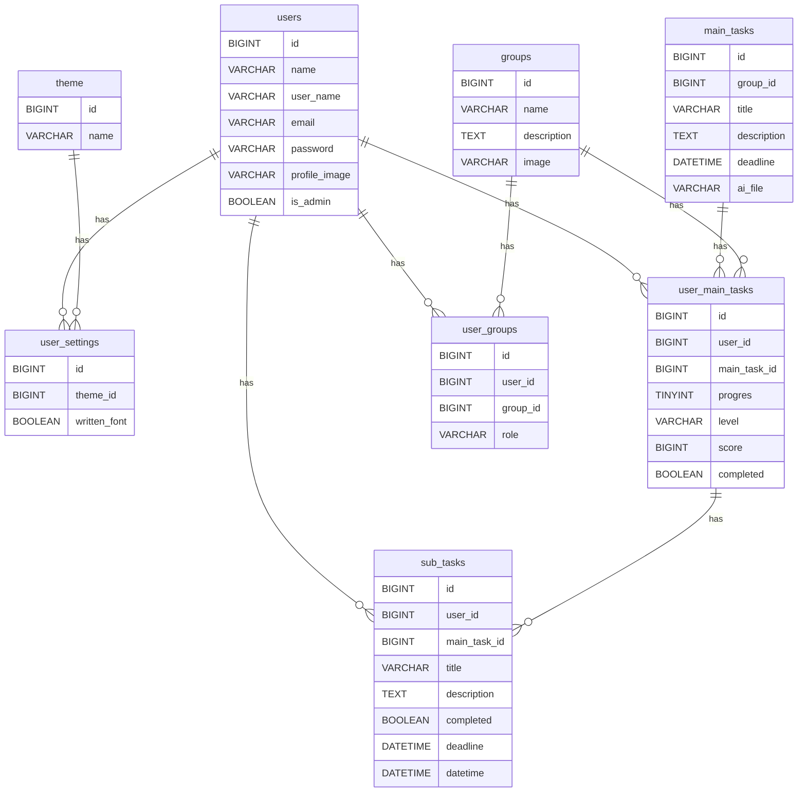

## Project Overview

Board-it is a app that helps students with ADHD to get the feeling of urgency to start tasks earlier. This is achieved with peer pressure (working together), deviding tasks and making progression visual.

## Key Features

- Devide tasks in to smaller tasks with AI or make them yourself.
- Get the urge to work by studing together with your friends.
- Add deadlines to your subtasks.
- Progression is visual.

## Tech Stack

| Part of application | Technology   | Parts of technology |
|---------------------|--------------|---------------------|
| Front-end           | React        | Router, Icons       |
| Front-end           | Shadcn       | -                   |
| Front-end           | Tailwind CSS | -                   |
| Back-end            | Laravel      | Breeze, JWT         |
| AI                  | Laravel AI   | -                   |
| AI                  | GPT-4        | -                   |

## Installation & Setup (thomas)

## Project Structure
In this repository we have worked with front-end and back-end in the same repository. The structure of our repository looks like this because of it:

board-it/
├── back-end/
    ├── app/
    ├── bootstrap/
    ├── config/
    ├── database/
    ├── public/
    ├── resources/
    ├── routes/
    ├── storage/
    ├── stubs/
    ├── tests/
    ├── .env
    ├── .gitignore
    ├── composer.json
    ├── composer.lock
    ├── package.json
    ├── package-lock.json
├── front-end/
    ├── public/
    ├── src/
        ├── assets/
        ├── components/
        ├── context/
        ├── lib/
        ├── pages/
        ├── app.jsx
        ├── index.css
        ├── layout.jsx
        ├── main.jsx
    ├── .gitignore
    ├── components.json
    ├── eslint.config.js
    ├── index.html
    ├── jsconfig.json
    ├── package.json
    ├── package-lock.json
    ├── vite.config.js
├── README.md

## ERD (thomas)

## API Endpoints (christa)

### Authentication & Login/register

- `POST /user/register` ~ User register
- `POST /user/login` ~ User login (Returns JWT token)

### Users

- `GET /user/` ~ Get all the users only user_name and id (Requires AUTH)
- `GET /user/{id}` ~ Get user details (Requires AUTH)
- `PUT /user/edit/{id}` ~ Edit user details (Requires AUTH)

### Groups

- `GET /group/` ~ Get all groups associated to the logged in user (Requires AUTH)
- `GET /group/{id}` ~ Get group details (Requires AUTH)
- `POST /group/create` ~ Create a group (Requires AUTH)
- `PUT /group/edit/{id}` ~ Edit group details (Requires AUTH)
- `DELETE /group/delete/{id}` ~ Delete the group (Requires AUTH)

### Maintasks

- `GET /main/` ~ Get maintasks associated to the logged in user (Requires AUTH)
- `GET /main/details/{id}` ~ Get details of a maintask (Requires AUTH)
- `POST /main/create` ~ Create a maintask (Requires AUTH)
- `PUT /main/edit/{id}` ~ Edit maintask details (Requires AUTH)
- `DELETE /main/delete/{id}` ~ Delete the maintask (Requires AUTH)

### Subtasks

- `GET /sub/{id}` ~ Get details of a subtask (Requires AUTH)
- `POST /sub/create` ~ Create subtask (Requires AUTH)
- `PUT /sub/edit/{id}` ~ Edit subtask details (Requires AUTH)
- `PATCH /sub/complete/{id}` ~ Complete a subtask (Requires AUTH)
- `DELETE /sub/delete/{id}` ~ Delete the subtask (Requires AUTH)

### AI routes
- `POST /main-tasks/{id}/generate-subtasks` ~ Generate subtasks with AI (Requires AUTH)

### Theme routes
- `GET /theme/` ~ Get the themes that exists (Requires AUTH)
- `GET /theme/details` ~ Get the theme settings of the user (Requires AUTH)
- `PUT /theme/edit` ~ Update de theme settings of the user (Requires AUTH)

## Deployment (christa)

## AI Integration (skye)

## Edge Cases (thomas)

### Authentication:

- Multiple login attempts what triggers rate limit.
- Token becomes invalid when logged in.
- User has no username or email what is required when logged in.
- Email or username is the same for multiple users.

### Task:

- User has no head-task but has sub-tasks.
- User has no group but has head-tasks.
- Head and sub-tasks has no title.
- Head-task has no deadline.
- Head-task is deleted but sub-tasks still exist.
- Group is deleted but head-tasks or sub-tasks still exist.

### AI:

- AI formats response incorrectly (incorrect formating)
- AI adds not needed tasks (dubble tasks, irrelevant tasks).
- AI has an internal error.
- AI tokens are gone, or AI server is down.
- AI rate limit is exceeded
- AI security policy stops the AI
- AI response is cut off due to token limit.

## front-end integration:

- Protected routes require JSON Web Tokens for authentication.
- Front-end routes have wrong route names, or wrong variable names causing failed requests.
