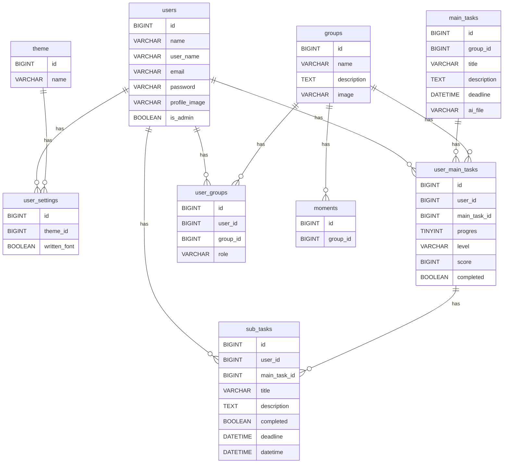

## Project Overview

Board-it is a app that helps students with ADHD to get the feeling of urgency to start tasks earlier. This is achieved
with peer pressure (working together), deviding tasks and making progression visual.

## Key Features

- Devide tasks in to smaller tasks with AI or make them yourself.
- Get the urge to work by studing together with your friends.
- Add deadlines to your subtasks.
- Progression is visual.

## Tech Stack

| Part of application | Technology     | Parts of technology |
|---------------------|----------------|---------------------|
| Front-end           | React          | Router, Icons       |
| Front-end           | Shadcn         | -                   |
| Front-end           | Tailwind CSS   | -                   |
| Back-end            | Laravel        | Breeze, MySQL       |
| Back-end            | Tymon          | JWT                 |
| Back-end            | Smalot         | PDF Parcer          |
| AI                  | Laravel AI SDK | -                   |
| AI                  | GPT-4          | -                   |

## Installation & Setup

### rerequisites

- Node.js
- Npm
- Composer
- MySQL
- Git

### Clone repository

```bash
git clone 
```

### Install Dependencies

```bash
cd front-end
composer install
```

```bash
cd back-end
npm install
```

### Set up database

```bash
php artisan migrate:fresh 
```

Drag database.sqlite in database slot in PHPStorm.

- Copy the env.example file and remove the example and add:
    - AI_KEY=
    - JWT_SECRET=

### Run the application

```bash
cd front-end
npm run dev
```

```bash
cd back-end
php artisan serve
```

## Project Structure

In this repository we have worked with front-end and back-end in the same repository. The structure of our repository
looks like this because of it:

````

board-it/
├── back-end/
----├── app/
----├── bootstrap/
----├── config/
----├── database/
----├── public/
----├── resources/
----├── routes/
----├── storage/
----├── stubs/
----├── tests/
----├── .env
----├── .gitignore
----├── composer.json
----├── composer.lock
----├── package.json
----├── package-lock.json
├── front-end/
----├── public/
----├── src/
--------├── assets/
--------├── components/
--------├── context/
--------├── lib/
--------├── pages/
--------├── app.jsx
--------├── index.css
--------├── layout.jsx
--------├── main.jsx
----├── .gitignore
----├── components.json
----├── eslint.config.js
----├── index.html
----├── jsconfig.json
----├── package.json
----├── package-lock.json
----├── vite.config.js
├── README.md

````

## ERD



## API Endpoints

### Authentication & Login/register

- `POST /user/register` ~ User register
- `POST /user/login` ~ User login (Returns JWT token)

### Users

- `GET /user/` ~ Get all the users only user_name and id (Requires AUTH)
- `GET /user/{id}` ~ Get user details (Requires AUTH)
- `PUT /user/edit/{id}` ~ Edit user details (Requires AUTH)

### Groups

- `GET /group/` ~ Get all groups associated to the logged in user (Requires AUTH)
- `GET /group/{id}` ~ Get group details (Requires AUTH)
- `POST /group/create` ~ Create a group (Requires AUTH)
- `PUT /group/edit/{id}` ~ Edit group details (Requires AUTH)
- `DELETE /group/delete/{id}` ~ Delete the group (Requires AUTH)

### Maintasks

- `GET /main/` ~ Get maintasks associated to the logged in user (Requires AUTH)
- `GET /main/details/{id}` ~ Get details of a maintask (Requires AUTH)
- `POST /main/create` ~ Create a maintask (Requires AUTH)
- `PUT /main/edit/{id}` ~ Edit maintask details (Requires AUTH)
- `DELETE /main/delete/{id}` ~ Delete the maintask (Requires AUTH)

### Subtasks

- `GET /sub/{id}` ~ Get details of a subtask (Requires AUTH)
- `POST /sub/create` ~ Create subtask (Requires AUTH)
- `PUT /sub/edit/{id}` ~ Edit subtask details (Requires AUTH)
- `PATCH /sub/complete/{id}` ~ Complete a subtask (Requires AUTH)
- `DELETE /sub/delete/{id}` ~ Delete the subtask (Requires AUTH)

### AI routes

- `POST /main-tasks/{id}/generate-subtasks` ~ Generate subtasks with AI (Requires AUTH)

### Theme routes

- `GET /theme/` ~ Get the themes that exists (Requires AUTH)
- `GET /theme/details` ~ Get the theme settings of the user (Requires AUTH)
- `PUT /theme/edit` ~ Update de theme settings of the user (Requires AUTH)

## Deployment

If this is the first time that you deploy the project on the server you need to create a script with `nano ./<name>.sh`
and name it something like: `configure_webserver` with this script:

```bash
#!/bin/bash

echo -n "Please provide your git (SSH!) repo link: "
read -r git_repo_link

echo -n "Please provide your project machine name (lowercase/no spaces): "
read -r project_machine_name

echo -n "Please provide your project normal human name: "
read -r project_name

###############################################################################

# Clone repository

###############################################################################

rm -rf ~/www/"$project_machine_name"
mkdir -p ~/www

git clone "$git_repo_link" ~/www/"$project_machine_name" || exit 1

###############################################################################

# Backend (Laravel)

###############################################################################

cd ~/www/"$project_machine_name"/back-end || exit 1

composer install --no-interaction --prefer-dist --optimize-autoloader || exit 1

php artisan key:generate --force
php artisan migrate --force

###############################################################################

# Frontend (React/Vite)

###############################################################################

cd ~/www/"$project_machine_name"/front-end || exit 1

npm install || exit 1
npm run build || exit 1

###############################################################################

# Deploy backend

###############################################################################

sudo rm -rf /var/www/backend
sudo mkdir -p /var/www/backend

sudo cp -R ~/www/"$project_machine_name"/back-end/. /var/www/backend

###############################################################################

# Deploy frontend

###############################################################################

sudo rm -rf /var/www/frontend
sudo mkdir -p /var/www/frontend

sudo cp -R ~/www/"$project_machine_name"/front-end/dist/. /var/www/frontend

###############################################################################

# Laravel permissions

###############################################################################

sudo chown -R www-data:www-data /var/www/backend
sudo chown -R www-data:www-data /var/www/frontend

sudo chmod -R 775 /var/www/backend/storage
sudo chmod -R 775 /var/www/backend/bootstrap/cache

###############################################################################

# Laravel storage link

###############################################################################

cd /var/www/backend || exit 1

sudo php artisan storage:link

###############################################################################

# Nginx

###############################################################################

sudo cp ~/nginx.conf /etc/nginx/sites-available/"$project_machine_name"

sudo ln -sf /etc/nginx/sites-available/"$project_machine_name" /etc/nginx/sites-enabled/"$project_machine_name"

sudo rm -f /etc/nginx/sites-enabled/default

###############################################################################

# Restart services

###############################################################################

sudo nginx -t || exit 1

sudo service php8.4-fpm restart
sudo service nginx restart

echo ""
echo "========================================"
echo "Deployment completed successfully!"
echo "========================================"
```

When you want to run the script you login on your server and type `./configure_webserver.sh` doing this will run the
script you made. Don't forget to put your .env file in the back-end folder on the server. You can do this with filezila
were you can just drag your own file in the server or you can make a new one with `nano .env` when your in the back-end
folder and copy and paste the lines that are in your .env in the server one. Make sure you change the `APP_URL` to the
right URL of the server and turn `APP_DEBUG` off.

After that the server should work already. When you want to deploy a new version of the main branche on the server you
need to make a new script with `nano ./<name>.sh` call it something like: `deploy` and and this script in there:

```bash
#!/bin/bash

echo -n "Please provide your project machine name (lowercase/no spaces): "
read -r project_machine_name

###############################################################################

# Git update

###############################################################################

cd ~/www/"$project_machine_name" || exit 1

git reset --hard HEAD

RESULT=$(git pull)

###############################################################################

# Backend (Laravel)
###############################################################################

cd ~/www/"$project_machine_name"/back-end || exit 1

composer install --no-interaction --prefer-dist --optimize-autoloader || exit 1

if [ ! -f .env ]; then
echo "ERROR: back-end/.env not found"
exit 1
fi

php artisan migrate:fresh --force || exit 1
php artisan db:seed --force || exit 1

###############################################################################

# Frontend (React)

###############################################################################

cd ~/www/"$project_machine_name"/front-end || exit 1

npm install || exit 1
npm run build || exit 1

###############################################################################

# Deploy backend

###############################################################################

sudo rsync -av --delete --exclude 'storage/' --exclude 'bootstrap/cache/' ~/www/"$project_machine_name"/back-end/ /var/www/backend/

###############################################################################

# Deploy frontend

###############################################################################

sudo rsync -av --delete ~/www/"$project_machine_name"/front-end/dist/ /var/www/frontend/

###############################################################################

# Permissions

###############################################################################

sudo chown -R www-data:www-data /var/www/backend
sudo chown -R www-data:www-data /var/www/frontend

sudo chmod -R 775 /var/www/backend/storage
sudo chmod -R 775 /var/www/backend/bootstrap/cache

###############################################################################

# Run migrations on live copy

###############################################################################

cd /var/www/backend || exit 1

sudo -u www-data php artisan migrate --force

echo "Deployment successful!"
```

To run this script you do the same thing as with the first one so you do `./deploy.sh` to run it. Important note: the
script does a migrate:fresh so your database will be empty. If you have important data in the database change that line
to `php artisan migrate --force || exit 1` !

## AI Integration

In this project, we integrated AI to support users in breaking down larger tasks into smaller, more manageable subtasks.
The AI is used as a planning assistant that helps generate structured subtasks based on the information provided by the
user and the linked document that belongs to the main task.

The AI integration was planned to be handled through the backend using the Laravel AI SDK, but it didn't seem to work
properly in our region. Instead of using Laravel AI SDK to it's full potential, we used a try/catch method to get it to
work properly. The frontend sends the user input, such as the context and the selected difficulty level, to the backend.
The backend then retrieves the linked AI file from the main task and combines this document content with the form input.
This information is sent to the AI model with a clear prompt that explains how the subtasks should be generated.

The AI is instructed to only use the information from the form and the linked document. It does not use the title or
description of the main task, and it does not add external information or make assumptions. This makes the generated
subtasks more relevant to the actual assignment and keeps the output focused on the provided material. The generated
output consists of multiple subtasks (between 8 and 20), each containing a title and a description. These subtasks are
returned as structured JSON, so they can be processed by the backend and saved in the database. This allows the
application to display the generated subtasks to the user in a clear and organized way.

We use AI in this project to make planning easier, especially for users who struggle with turning a large assignment
into smaller steps. Instead of creating all subtasks manually, the AI gives users a useful starting point that they can
follow, adjust, or expand if needed.

## Edge Cases

### Authentication:

- Multiple login attempts what triggers rate limit.
- Token becomes invalid when logged in.
- User has no username or email what is required when logged in.
- Email or username is the same for multiple users.

### Task:

- User has no head-task but has sub-tasks.
- User has no group but has head-tasks.
- Head and sub-tasks has no title.
- Head-task has no deadline.
- Head-task is deleted but sub-tasks still exist.
- Group is deleted but head-tasks or sub-tasks still exist.

### AI:

- AI formats response incorrectly (incorrect formating)
- AI adds not needed tasks (dubble tasks, irrelevant tasks).
- AI has an internal error.
- AI tokens are gone, or AI server is down.
- AI rate limit is exceeded
- AI security policy stops the AI
- AI response is cut off due to token limit.

## front-end integration:

- Protected routes require JSON Web Tokens for authentication.
- Front-end routes have wrong route names, or wrong variable names causing failed requests.
